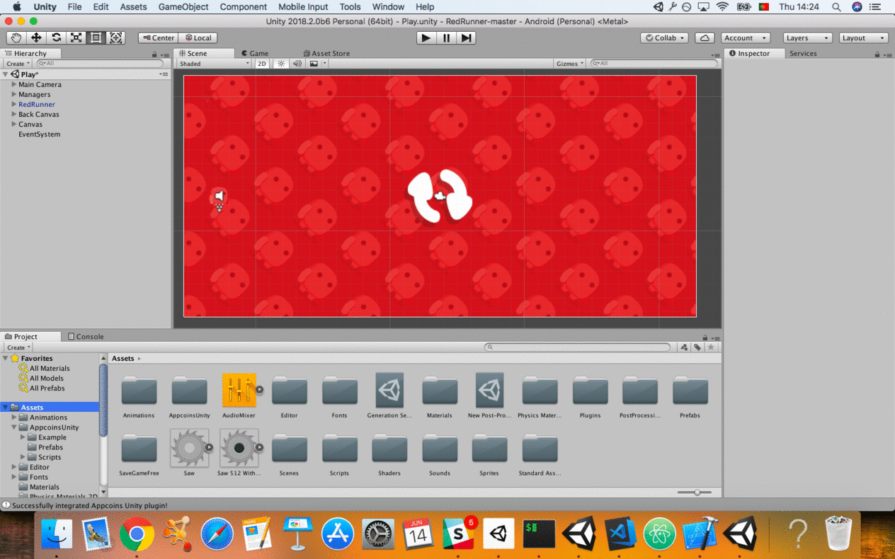
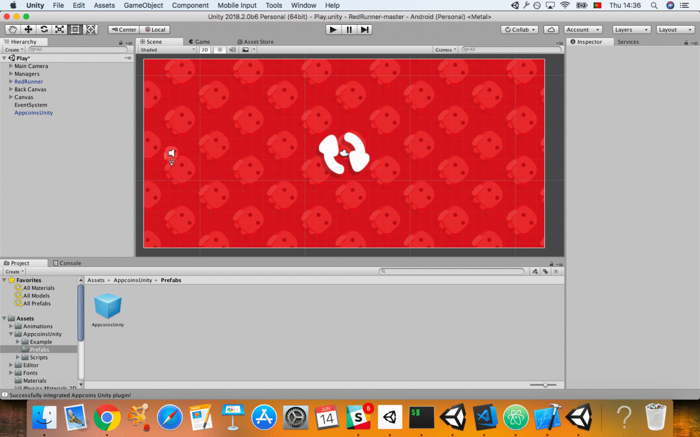
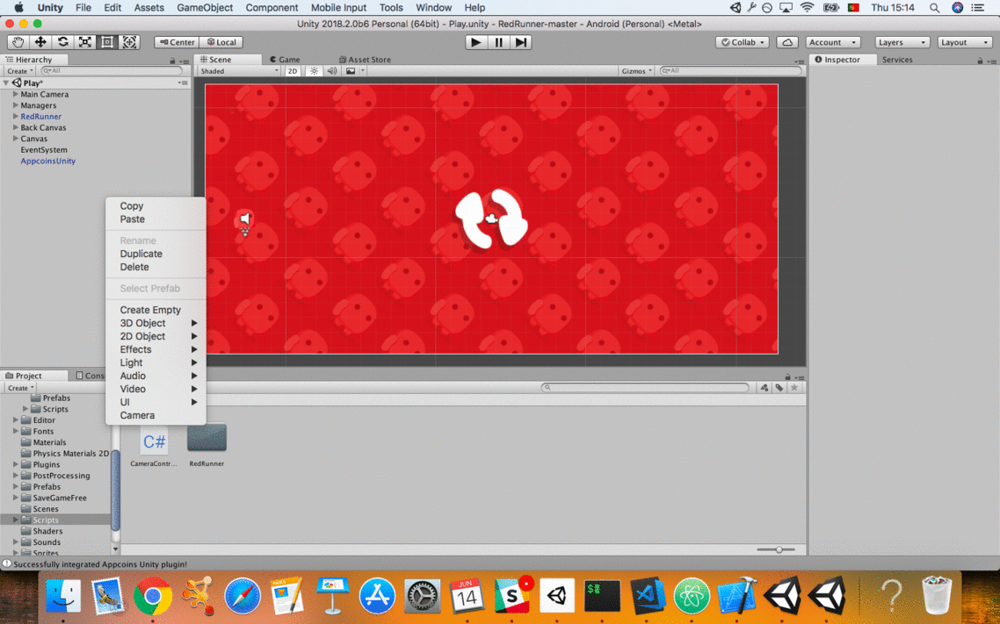
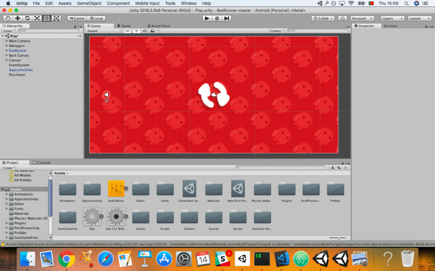

# Red Runner

Red Runner, Awesome Platformer Game.

It is now free and open source and always will be. :clap: :tada:

| [:sparkles: Getting Started](#getting-started) | [:rocket: Download](#download) | [:camera: Screenshots](#screenshots) | [APPCoins Plugin Integration](#appcoins) |
<p align="center">
  
</p>

[:camera: See Screenshots](#screenshots)

[:movie_camera: **See the Trailer**](https://youtu.be/MO2yJhgtMes)

## Getting Started

Follow the below instructions to get started with Red Runner source code:

1. [Make sure you have all Requirements](#requirements)
2. [Download Source Code](#download)
3. Open Project in Unity and Enjoy!

## Requirements

Make sure you have the below requirements before starting:

- [Unity Game Engine](https://unity3d.com)
- Basic Knowledge about Unity and C#

## Download

You can get access to Red Runner source code by using one of the following ways:

- [:sparkles: Download Source Code](https://github.com/BayatGames/RedRunner/archive/master.zip)
- [:fire: Download Source Code from Itch.io](https://bayat.itch.io/red-runner)
- Clone the repository locally:

```bash
git clone https://github.com/BayatGames/RedRunner.git
```

Also you can the build version of the Red Runner using the following ways:

- [:star: Download from Itch.io](https://bayat.itch.io/red-runner)

## Screenshots

<p align="center">
  
</p>

<p align="center">
  
</p>

<p align="center">
  
</p>

<p align="center">
  
</p>

## APPCoins Plugin Integration Example
This is just an example of how you can integrate the appcoins plugin into your game.
1. Download [Appcoins unity package](https://github.com/AppStoreFoundation/AppcoinsUnityPlugin/blob/develop/AppCoins_Unity_Package.unitypackage).
2. At Unity open your game's folder and import the Appcoins unity package you just downloaded. You can do this by clicking in 'Assets' -> 'Import Package' -> 'Custom Package...'. You have to import everything except the '/Appcoins/Example' folder that is optional. This folder is just another integration example.


3. Drag and drop to your hierarchy window the 'Assets/AppCoins/Prefabs/AppCoinsUnity.prefab' prefab file. If you want you can change the name of the AppcoinsUnity game object to whatever you want to.


4. Open AppcoinsUnity game object in the inspector window and put the wallet's address where you want to receive your appcoins in the 'receiving address' box.


5. For this example, after the first death if the player wants to play again he has to buy a life. So when the restart button is clicked I will redirect the game's flow to my 'Purchaser' class calling the 'buyContinue' method in 'OnResetButtonPressed' in 'GameManager.cs' (the 'Purchaser' class have to inherit from 'AppcoinsPurchaser' class). My 'Purchaser.cs' file:

```
/* add this namespace to your script to give you  access to
the plugin classes. */
using Codeberg.AppcoinsUnity;

using RedRunner;

public class Purchaser : AppcoinsPurchaser
{

    //method gets called on successful purchases
    public override void purchaseSuccess(string skuid)
    {
        base.purchaseSuccess(skuid);
        //purchase is successful release the product

        if (skuid == "continue")
            GameManager.Singleton.OnPurchaseSuccessful();
    }
    //method gets called on failed purchases
    public override void purchaseFailure(string skuid)
    {
        base.purchaseFailure(skuid);
        //purchase failed perhaps show some error message

        GameManager.Singleton.OnPurchaseFailed();
    }

    //example methods to initiate a purchase flow
    /*the string parameter of the makePurchase method is the
    skuid you specified in the inspector for each product */
    public void buyContinue()
    {
        makePurchase("continue");
    }
}
```

6. Create an empty game object with the name you want and add the script that has the 'Purchase' class. Then drag and drop it to the slot named 'Purchaser Object' in AppcoinsUnity game object.


7. Now I just have to create a product with the 'skuid' named 'continue'. To do this create a folder with the name 'Appcoins_Products' in the '/Assets' folder (This step is optional).
Then go to 'Assets' -> 'Create' -> 'Appcoins Product'. At the inspector window after you clicked the 'AppcoinsUnity' game object go to the Products' slot, put the size to '1', then drag and drop your created product to Element 0's slot.


8. Your game is ready to rock!

## Credits

- Graphics: [Free Platform Game Assets](https://bayat.itch.io/platform-game-assets)
- Save System: [Save Game Pro - Save Everything](https://bayat.itch.io/save-game-pro-save-everything)
- Game Engine: [Unity](https://unity3d.com/)
- Thanks to all of the game development community for their awesome help.

## Related

- [Awesome Unity](https://github.com/RyanNielson/awesome-unity) - A curated list of awesome Unity assets, resources, and more.
- [Games on GitHub](https://github.com/leereilly/games/) - 🎮 A list of popular/awesome videos games, add-ons, maps, etc. hosted on GitHub. Any genre. Any platform. Any engine.
- [GameDev Resources](https://github.com/Kavex/GameDev-Resources) - 🎮 🎲 A wonderful list of Game Development resources.
- [UnityLibrary](https://github.com/UnityCommunity/UnityLibrary) - 📚 Library of all kind of scripts, snippets & shaders for Unity.

## Resources

[:rocket: Patreon](https://www.patreon.com/BayatGames)

[:newspaper: Support and News](https://github.com/BayatGames/Support)

## License

MIT @ [Bayat Games](https://github.com/BayatGames)

Made with :heart: by [Bayat Games](https://github.com/BayatGames)
